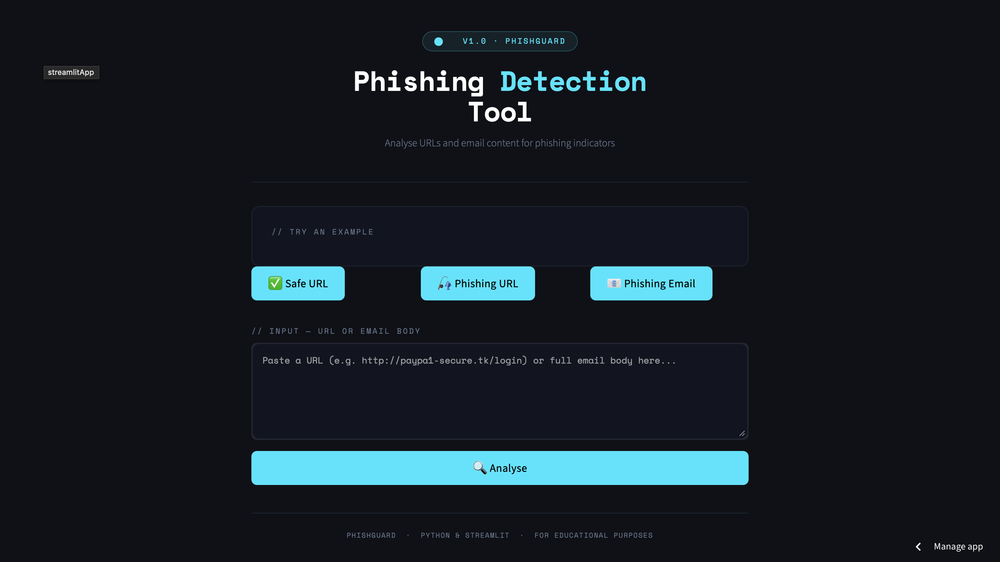
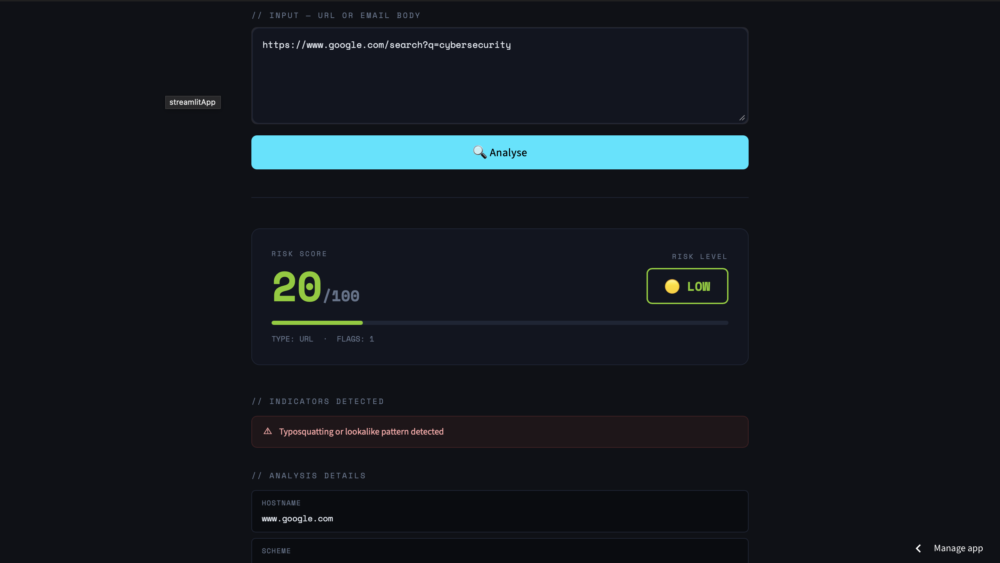
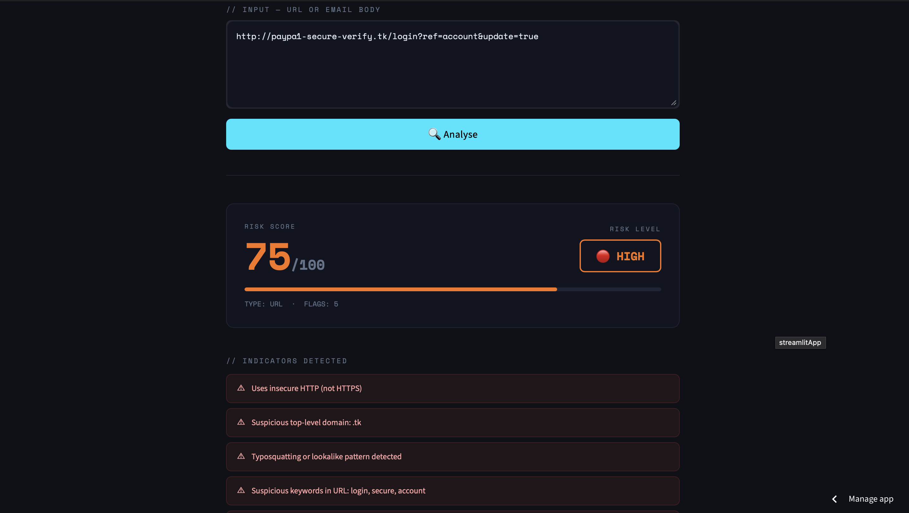
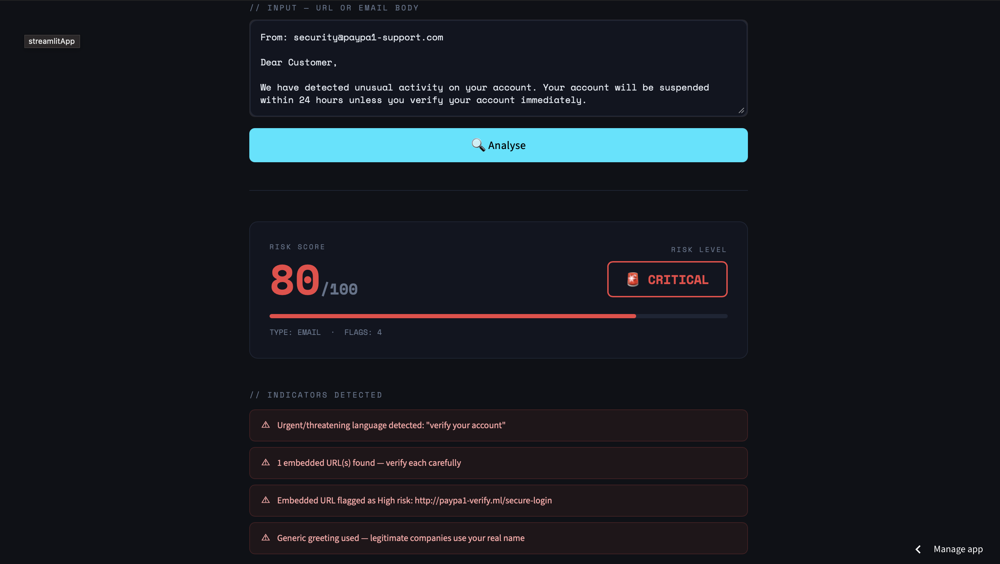

# 🛡️ PhishGuard – Phishing Detection Tool

A **Python-based phishing detection system** that analyses URLs and email content for suspicious indicators, deployed using **Streamlit Cloud**.

This project demonstrates how to build a **security tool pipeline** including pattern matching, heuristic analysis, risk scoring, and a real-time detection dashboard.

---

# 🚀 Live Demo

Try the deployed application here:

https://feqv3pwouw78dyrdkigrqz.streamlit.app

---

# 📊 Dashboard Preview

The dashboard allows users to paste any URL or email body and receive an **instant phishing risk score**.

---

# 🔎 Safe URL Detection

The system correctly identifies legitimate URLs and returns a clean result.

---

# 🎣 Phishing URL Detection

Suspicious URLs are flagged with detailed indicators explaining why they are dangerous.

---

# 📧 Phishing Email Detection

Email bodies are scanned for urgent language, mismatched senders, embedded malicious URLs, and more.

---

# 📊 Project Features

- Real-time URL and email body analysis
- Multi-layered heuristic detection engine
- Risk scoring system from 0–100
- Risk levels: Safe / Low / Medium / High / Critical
- Detailed breakdown of every suspicious indicator found
- Interactive dashboard built with **Streamlit**
- Auto-detection of input type (URL vs email)
- CLI mode — run analysis directly from the terminal

---

# 🧠 Detection Techniques Used

### URL Analysis
The system checks for:

- Insecure HTTP instead of HTTPS
- Raw IP addresses used as hostnames
- Suspicious top-level domains (.tk, .ml, .xyz, .top…)
- Brand impersonation in URLs (PayPal, Amazon, Google…)
- Typosquatting and leet-speak patterns (paypa1, g00gle…)
- Excessive subdomains
- Unusually long URLs
- Deceptive keywords in paths (login, verify, secure…)
- @ symbols used to obscure destinations
- Hyphenated domain names

### Email Analysis
The system checks for:

- Urgent or threatening language
- Embedded phishing URLs
- Mismatched sender domains
- Generic greetings (Dear Customer, Dear User…)
- Requests for sensitive information
- Spelling and grammar errors
- Suspicious attachment mentions

---

# 🏗 Project Architecture

phishing-detector/
│
├── detector.py          # Core detection engine (import or run standalone)
├── streamlit_app.py     # Interactive Streamlit dashboard
├── app.py               # Flask web application (local version)
├── requirements.txt     # Python dependencies
├── templates/
│   └── index.html       # Flask web UI
└── README.md

This structure separates the system into:

- **Detection Engine** – URL and email heuristic analysis
- **Risk Scorer** – Weighted scoring system (0–100)
- **Deployment Layer** – Interactive Streamlit dashboard

---

# ⚙️ Detection Pipeline

### 1️⃣ Input Detection
Auto-detects whether the input is a URL or an email body.

### 2️⃣ Feature Extraction
Key phishing signals are extracted including domain structure, keywords, language patterns, and sender metadata.

### 3️⃣ Heuristic Analysis
Each extracted feature is checked against a rule-based detection engine built from known phishing patterns.

### 4️⃣ Risk Scoring
Each matched indicator adds a weighted score to the total risk score (0–100).

### 5️⃣ Risk Classification
The final score maps to a risk level:

Score | Risk Level
0–14 | ✅ Safe
15–34 | 🟡 Low
35–59 | 🟠 Medium
60–79 | 🔴 High
80–100 | 🚨 Critical

### 6️⃣ Results Display
A full breakdown of every indicator detected is shown on the dashboard.

---

# 📈 How It Works — Scoring Breakdown

### URL Checks

Check | Score Added
Uses HTTP instead of HTTPS | +10
Raw IP address as host | +25
Suspicious TLD (.tk, .ml, .xyz…) | +20
Brand impersonation in URL | +30
Typosquatting / leet-speak patterns | +20
Excessive subdomains | +15
Unusually long URL | +10
Deceptive keywords in path | +15
@ symbol in URL | +20
Hyphenated domain name | +10

### Email Checks

Check | Score Added
Urgent / threatening language | up to +40
Embedded phishing URLs | +20 per URL
Mismatched sender domain | +35
Generic greeting (Dear Customer) | +10
Requests for sensitive info | +30
Spelling/grammar errors | +15
Mentions attachments | +15

---

# 💡 Example Test Inputs

Phishing URL:
http://paypa1-secure-verify.tk/login?ref=account&update=true

Safe URL:
https://www.google.com/search?q=cybersecurity

Phishing Email:
From: security@paypa1-support.com

Dear Customer,

We have detected unusual activity on your account. Your account will be
suspended within 24 hours unless you verify your account immediately.

Click here: http://paypa1-verify.ml/secure-login

Failure to act now will result in permanent account closure.

---

# ▶ Running the Project Locally

Clone the repository:
git clone https://github.com/miyabrijesh/phishing-detector.git

Navigate into the project folder:
cd phishing-detector

Install dependencies:
pip install -r requirements.txt

Run the Streamlit dashboard:
streamlit run streamlit_app.py

Or run the CLI version:
python detector.py

Or run the Flask web app:
python app.py

Then open your browser at: http://localhost:5000

---

# 🛠 Technologies Used

- Python 3.10+
- Streamlit
- Flask 2.3+
- HTML / CSS / JavaScript (vanilla)
- Regex & Heuristic Pattern Matching
- urllib (URL parsing)

---

# 🔮 Future Improvements

- Machine learning classifier trained on real phishing datasets (scikit-learn)
- VirusTotal or Google Safe Browsing API integration
- Browser extension wrapper
- Email header parser (.eml file support)
- Export scan report as PDF
- SHAP-based explainability for ML predictions
- Real-time URL reputation lookup

---

# 👩‍💻 Author

Developed by Miya Brijesh

If you found this project useful, feel free to ⭐ the repository!

---

*Built as a cybersecurity project. For educational purposes only.*
